# A Mansão Esquecida

> "O passado nem sempre aceita ser perturbado..."

## Sobre o Projeto

**A Mansão Esquecida** é um jogo de aventura em texto (Text-Based Adventure) desenvolvido em Java. O jogador assume o
papel de um investigador paranormal que deve explorar a antiga mansão da família Bakers, palco de uma tragédia brutal em
1970.

O objetivo é explorar os cômodos, coletar pistas, resolver enigmas e capturar as almas atormentadas que ainda habitam o
local. O jogo foca em imersão narrativa, utilização de comandos via terminal e resolução de puzzles.

---

## Funcionalidades Técnicas

Este projeto foi desenvolvido aplicando conceitos sólidos de Orientação a Objetos e Padrões de Projeto:

* **Padrão Command:** Utilizado para processar as ações do jogador (`ir`, `pegar`, `salvar`), permitindo fácil extensão
  de novos comandos.
* **Persistência de Dados (Save/Load):** Implementação de serialização nativa do Java para salvar o estado completo do
  jogo (inventário, posição, estado dos fantasmas).
* **Polimorfismo:** Diferentes tipos de Fantasmas (`Fighter`, `Intelligent`, `Fat`) e Itens, cada um com comportamentos
  únicos de interação.
* **Java Records:** Utilização de `Records` para transporte imutável de dados entre a lógica de comando e a interface do
  usuário.
* **Interface Híbrida:** O jogo roda no terminal, mas utiliza `Swing` para exibir popups visuais de itens especiais (
  como fotos e pistas).

---

## Como Jogar

O jogo é controlado via linha de comando.
Para interagir com o mundo de Bethinhas, utilize os comandos abaixo no terminal. O jogo entende o comando principal e
diversas variações (sinônimos).

### Movimentação e Exploração

| Ação | Comando Principal | Variações Aceitas             | Descrição |
| :--- | :--- |:------------------------------| :--- |
| **Entrar/Ir** | `ir` | `entre`, `entrar`, `vá`, `va` | Move o personagem para uma nova direção ou local. |
| **Voltar** | `voltar` | `volte`                       | Retorna para a sala ou local anterior. |
| **Olhar** | `olhar` | -                             | Descreve o ambiente atual ou examina algo. |
| **Destrancar**| `destrancar`| -                             | Abre portas ou baús trancados (se tiver a chave). |

### Inventário e Itens

| Ação | Comando Principal | Variações Aceitas | Descrição |
| :--- | :--- | :--- | :--- |
| **Inventário**| `inventario` | - | Lista todos os itens que você carrega. |
| **Pegar** | `pegar` | `pegue`, `coletar`, `colete` | Adiciona um item do ambiente ao seu inventário. |
| **Largar** | `largar` | `solte`, `soltar` | Remove um item do inventário e o deixa no local. |

### Interação e Fantasmas

| Ação | Comando Principal | Variações Aceitas | Descrição                                     |
| :--- |:------------------|:------------------|:----------------------------------------------|
| **Capturar** | `capturar`        | -                 | Tenta capturar um fantasma presente no local. |
| **Ler** | `ler`             | -                 | Lê documentos, livros ou notas encontradas.   |
| **Exibir** | `exibir`          | `ver`              | Exibe um item na interface gráfica.           |

### Sistema

| Ação | Comando Principal | Variações Aceitas | Descrição |
| :--- | :--- | :--- | :--- |
| **Salvar** | `salvar` | `save` | Salva o progresso atual do jogo. |
| **Carregar** | `carregar` | `load` | Carrega o último jogo salvo. |
| **Sair** | `sair` | - | Encerra o jogo. |

---

## Instalação e Execução

### Pré-requisitos

* Java JDK 17 ou superior.

### Rodando o .JAR

1. Baixe o arquivo `a-mansao-esquecida.jar` na aba de Releases.
2. Abra o terminal na pasta do arquivo.
3. Execute o comando:
   ```bash
   java -jar a-mansao-esquecida.jar
   ```

# Diagrama de classes

```mermaid
classDiagram
%% --- RELAÇÕES PRINCIPAIS ---
    Game *-- Mansion: Compõe
    Game *-- Player: Compõe
    Game *-- CommandRegistry: Usa
    Game *-- Parser: Usa
    Game ..> SaveManager: Usa
    Game ..> StoryTeller: Usa
%% --- ESTRUTURA DO MAPA ---
    Mansion *-- Location: Contém várias
    Location o-- Location: Saídas (Exits)
    Location o-- Item: Contém vários
    Location o-- Phantom: Pode ter
    Location o-- Key: Pode ter
    Location <|-- Balcony
    Location <|-- BathRoom
    Location <|-- Hallway
    Location <|-- Kitchen
    Location <|-- LivingRoom
    Location <|-- Room
    Location <|-- Stair
%% --- ITENS ---
    Item <|-- Food
    Item <|-- Key
    Item <|-- Picture
    Item <|-- Mail
%% --- FANTASMAS ---
    Phantom <|-- FatPhantom
    Phantom <|-- IntelligentPhantom
    Phantom <|-- FighterPhantom
%% --- COMANDOS ---
    CommandRegistry o-- Command: Registra
    Command <|.. LoadCommand: Implementa
    Command <|.. QuitCommand: Implementa
    Command <|.. SaveCommand: Implementa
    Command <|.. LookCommand: Implementa
    Command <|.. UnlockCommand: Implementa
    Command <|.. CaptureCommand: Implementa
    Command <|.. BackCommand: Implementa
    Command <|.. DropCommand: Implementa
    Command <|.. InventoryCommand: Implementa
    Command <|.. TakeCommand: Implementa
    Command <|.. ReadCommand: Implementa
    Command <|.. ShowCommand: Implementa
%% --- JOGADOR ---
    Player o-- Location: Local Atual
    Player o-- Set~Item~: Inventário
%% --- DEFINIÇÃO DAS CLASSES ---
    class Game {
        -Mansion mansion
        -Player currentPlayer
        -CommandRegistry registry
        +play(): void
        +loadState(Save): void
    }

    class Player {
        -String name
        -Integer health
        -Integer maxHealth
        -Location currentLocation
        -Stack~Location~ locationPath
        -Set~Item~ inventory
        -List~Phantom~ capturedPhantoms
        +registerLocation(Location): void
        +addItem(Item): void
        +findItem(String): Item
        +removeItem(Item): void
        +getResponse(): String
        +takeDamage(int damage): void
    }

    class Mansion {
        -Set~Location~ locations
        -Location initialLocation
        -Set~Item~ items;
        -Set~Phantoms~ phantoms;
        +init()
    }

    class Location {
        <<Abstract>>
        -String description
        -Map~String, Location~ exits
        -Set~Item~ items
        -Boolean locked
        -Key key
        +addItem(Item): void
        +findItem(String): Item
        +removeItem(Item): void
        +getExit(to): Optional<Location>
        +addExit(to, location): void
    }

    class Item {
        <<Abstract>>
        -String name
        -String description
    }

    class Key {
        -Location location
        +unlock(): void
    }

    class Mail {
        -String filename
        +read(): String
    }

    class Picture {
        -String filename
        +showImage(): void
    }

    class PhantomInteractResult {
        <<Record>>
        +Boolean success
        +String[] messages
    }

    class Phantom {
        <<Abstract>>
        -String name
        -Boolean captured
        -String introText
        -String whoCapture
        +capture(Player): PhantomInteractResult
    }

    class FatPhantom {
        -List~Item~ itemsForCapture
    }

    class FighterPhantom {
        -int health
        -int maxHealth
        -int attackPower
        -List~Item~ itemsForCapture
    }

    class IntelligentPhantom {
        -String puzzleDescription
        -List~String~ puzzleResponses
    }

    class CommandResult {
        <<Record>>
        +Boolean success
        +String[] messages
    }

    class Command {
        <<Interface>>
        +execute(Player, argument): CommandResult
    }

    class CommandRegistry {
        -Map~String, Command~ commands
        +registerCommand(): void
        +getCommand(): Command
    }

    class SaveManager {
        +saveGame(Save)
        +loadGame(): Save
    }

    class StoryTeller {
        +playIntro(): void
    }

    class Parser {
        -Scanner read
        +readLine(): String
    }
```

